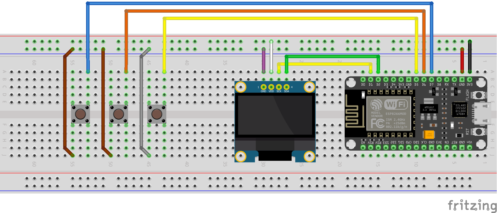
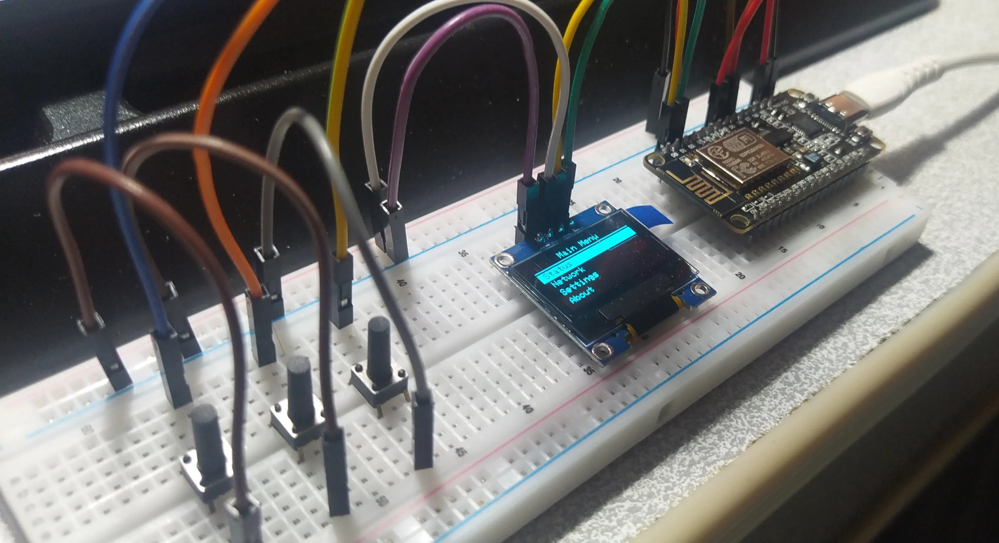

# README

# OLED Menu UI for ESP8266 using Adafruit Libraries

This project demonstrates a **simple yet professional menu interface** on a **128x64 SSD1306 OLED display** using an **ESP8266** board with the **Adafruit_SSD1306** and **Adafruit_GFX** libraries.

The primary goal of this project is **learning UI development for embedded devices** and handling push-button interactions.

---

## Features

- Main menu with four items: `Status`, `Network`, `Settings`, `About`
- Navigate the menu using three buttons:
    - `BTN_UP` → Move selection up
    - `BTN_DOWN` → Move selection down
    - `BTN_SELECT` → Select item
- “Main Menu” title is **centered horizontally**
- Selected menu item is highlighted with **white background and black text**
- Software debounce implemented for all buttons
- Clean separation of **menu logic** and **display rendering**
- Display connected via **I2C**

---

## Required Hardware

- ESP8266 board
- 128x64 OLED display with I2C interface
- 3 push buttons
- Internal pull-ups enabled (`INPUT_PULLUP`)

## Circuit Schematic

---

## Recommended Wiring

**OLED Connections:**

| OLED Pin | ESP8266 Pin |
| --- | --- |
| VCC | 3.3V |
| GND | GND |
| SDA | D2 (GPIO5) |
| SCL | D1 (GPIO4) |

**Push Button Connections:**

| Button | ESP8266 Pin |
| --- | --- |
| BTN_UP | D5 (GPIO14) |
| BTN_DOWN | D6 (GPIO12) |
| BTN_SELECT | D7 (GPIO13) |

---

## Library Installation

Before compiling, install the following libraries via Arduino Library Manager:

- [Adafruit SSD1306](https://github.com/adafruit/Adafruit_SSD1306)
- [Adafruit GFX Library](https://github.com/adafruit/Adafruit-GFX-Library)

---

## Usage

1. Open the project in Arduino IDE.
2. Select your ESP8266 board type.
3. Adjust I2C pins in `Wire.begin(SDA, SCL)` if necessary.
4. Upload the code to your board.
5. The OLED display will show the main menu.
6. Navigate using the buttons and select items.

---

## Code Overview

### Button Debouncing

- Each button is represented by a `Button` struct.
- Debounce logic ensures a stable press detection with **50 ms delay**.
- Pressed state is stored and checked in the `loop()`.

### `readButtons()` Function

- Checks all three buttons independently.
- Updates `pressed` flags without blocking execution.

### `printMenu()` Function

- Clears the display and prints the centered title.
- Draws a separator line below the title.
- Highlights the selected menu item with a **white rectangle**.
- Uses consistent vertical spacing for menu items.
- Refreshes the display using `display.display()`.

### `loop()` Function

- Reads button states and updates `selectedIndex`.
- Calls `printMenu()` only when the menu changes.
- Selected item is printed to Serial Monitor (can later trigger dedicated pages).

---

## Learning Objectives

- Working with **SSD1306 OLED** and **Adafruit GFX**.
- Building **embedded menu UIs** using buttons.
- Separating **menu logic** from **UI rendering**.
- Implementing **software debounce** for reliable button input.

---

---

## License

This project is released under the **MIT License**.